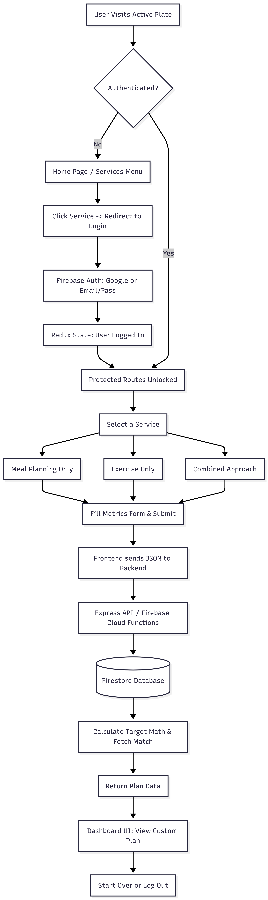

# 🏋️‍♂️ ACTIVE PLATE

## 1. Project Overview
Active Plate is a full-stack fitness and nutrition web application designed to help users establish a healthier lifestyle. The platform calculates user-specific body metrics and preferences to dynamically generate highly personalized meal plans, workout routines, or a complete combined approach. 

## 2. Key Features
* **Secure Authentication:** Users must register or log in (via Email/Password or Google OAuth) to access the core services.
* **Protected Routing:** Frontend UI routes are strictly secured utilizing Redux state management.
* **Algorithmic Plan Generation:** The backend calculates Basal Metabolic Rate (BMR) and adjusts calorie targets based on the user's primary goal (Lose Weight / Build Muscle).
* **Rule-Based Tagging:** User preferences (Location, Experience, Diet Type) are dynamically matched against database records to return the perfect plan.
* **Modern UI/UX:** Built with Tailwind CSS and Framer Motion for smooth, professional screen transitions and loading states.

## 3. System Architecture & User Flow
When a user interacts with the platform, their authentication state dictates their access. Once verified, they can submit their physical metrics to the Node.js backend, which processes the data, queries Firestore, and returns a tailored response.

 

## 4. Tech Stack

**Frontend (`/clients`)**
* **React.js (v18)** - Core UI framework
* **Tailwind CSS** - Styling and responsive design
* **Redux** - Global state management (User Auth State)
* **Framer Motion** - UI animations and transitions
* **React Router DOM** - Navigation and protected routing
* **Firebase Auth** - User authentication processing

**Backend (`/servers/functions`)**
* **Node.js & Express.js** - REST API routing
* **Firebase Cloud Functions** - Serverless backend architecture
* **Firebase Admin SDK** - Secure database connectivity
* **Firestore** - NoSQL Database storing all structural Meal and Exercise plans
* **Cors** - Cross-Origin Resource Sharing management

## 5. Project Structure

```text
Active-Plate/
├── clients/               # React Frontend Environment
│   ├── src/
│   │   ├── assets/        # Images and visual assets
│   │   ├── components/    # Reusable UI (Forms, Dashboards, ProtectedRoute)
│   │   ├── config/        # Firebase frontend configuration
│   │   ├── containers/    # Main page layouts (Home, Main)
│   │   ├── context/       # Redux reducers and actions
│   │   └── App.js         # Main application router
│   └── package.json       
│
└── servers/
    └── functions/         # Node.js Backend Environment
        ├── routes/        # Express API endpoints (mealPlan, exercisePlan, combinedPlan)
        ├── index.js       # Express server initialization & middleware
        └── package.json   

```

## 6. Local Setup & Installation

To run this application locally, you will need to start both the backend server and the frontend client simultaneously.

### Backend Setup

1. Navigate to the backend directory:
```bash
cd servers/functions

```


2. Install dependencies:
```bash
npm install

```


3. Start the Firebase local emulator (Ensure you have your Firebase `serviceAccountKey.json` properly configured):
```bash
npm run serve

```


*The local API will run on `http://127.0.0.1:5001/*`

### Frontend Setup

1. Open a new terminal window and navigate to the client directory:
```bash
cd clients

```


2. Install dependencies:
```bash
npm install

```


3. Start the React development server:
```bash
npm start

```


*The web application will run on `http://localhost:3000/*`

## 7. Future Enhancements

* Implement full 30-day tracking for users to check off daily meals and workouts.
* Add a profile dashboard to track and visualize weight loss or muscle gain progress over time.
* Integrate an AI chatbot for real-time fitness query resolution.